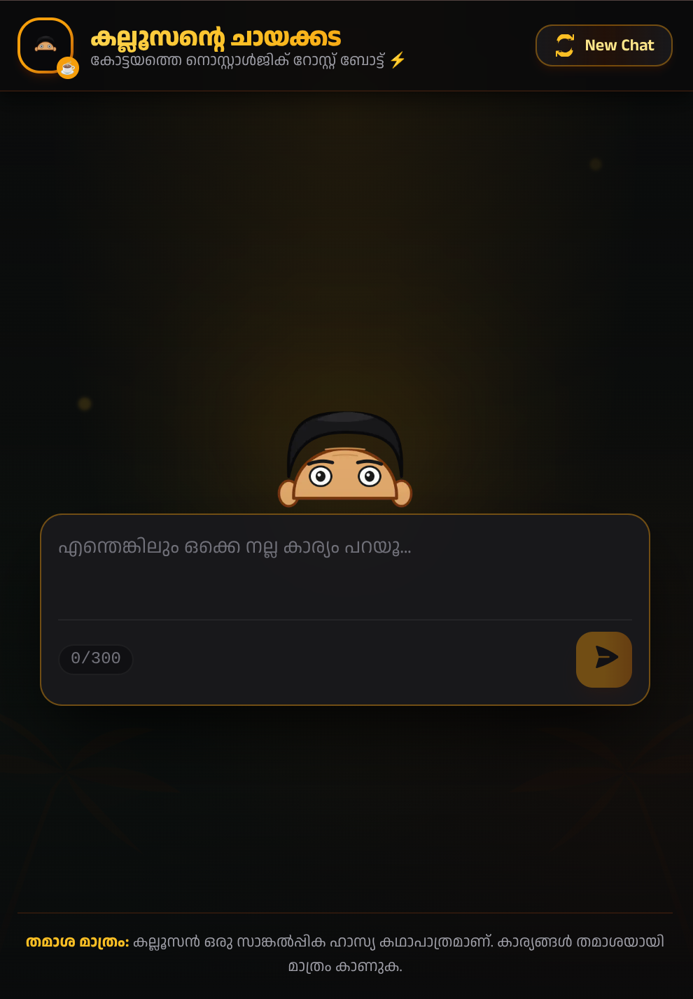
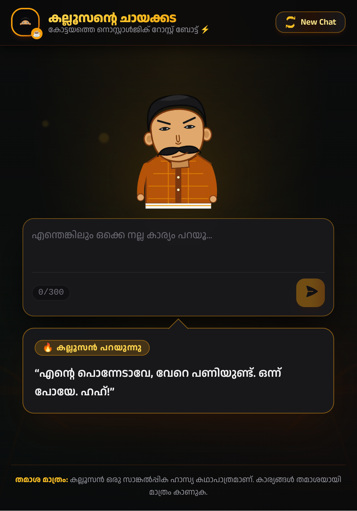

# Kalloosante Chayakkada 🎯

## Basic Details

### Team Name: Kalloosante Chayakkada

### Team Members

- Team Lead: Mohammed Mazin Cheriyan - TKM College of Engineering
- Member 2: Abhaj Khan - TKM College of Engineering

### Project Description

Kalloosante Chayakkada is a playful AI roast bot for Malayali users. Share an idea, plan, or good news and Kalloosan, an original fictional Kottayam-style tea-shop character, finds the negative angle and delivers a short, friendly roast in Malayalam script.

The app reacts as the user types, preserves lightweight conversation context during the current page session, and animates a layered 2D character through each interaction.

### The Problem (that doesn't exist)

People have somehow become capable of saying positive things about their lives without immediately being reminded why those things might be a terrible idea.

Bought a new car? Petrol is expensive. Planning a trip? Money is about to disappear. Got a promotion? Congratulations, now you have more work. Humanity clearly needed an AI dedicated to finding the downside.

### The Solution (that nobody asked for)

Meet Kalloosan: an overconfident, slightly jealous tea-shop character who turns everyday updates into short, friendly roasts. The app uses an LLM to generate Malayalam-script counter-negative responses, then maps each response to an emotion and gesture for the animated character.

Kalloosan is an original fictional character, not an imitation of any real person. The experience is comedy rather than advice, and messages indicating genuine distress can follow a `skipRoast` path.

## Technical Details

### Technologies/Components Used

For Software:

- Language: TypeScript
- Framework: Next.js 14 App Router with React 18
- Styling: Tailwind CSS
- Animation: Framer Motion
- State management: Zustand, with in-memory session state
- Validation: Zod
- AI roast generation: Groq REST API
- Active model: `qwen/qwen3.8-27b`
- Failover model: `qwen/qwen3.6-27b`
- Optional text-to-speech: Gemini TTS API, disabled by default
- Rate limiting: Upstash Redis and `@upstash/ratelimit`, with an in-memory local fallback
- Deployment target: Vercel

For Hardware:

- No dedicated hardware is required.
- The app is designed for modern mobile and desktop browsers, including low-end Android devices.

### Implementation

For Software:

# Installation

```bash
git clone https://github.com/mzziin/kallusante-chayakada.git
cd kallusante-chayakada
npm install
```

Create `.env.local` in the project root:

```env
# Required for generated roasts
GROQ_API_KEY=gsk_your_groq_api_key_here
GROQ_MODEL=qwen/qwen3.8-27b

# Optional in local development; otherwise an in-memory limiter is used
UPSTASH_REDIS_REST_URL=https://your-instance.upstash.io
UPSTASH_REDIS_REST_TOKEN=your_upstash_token

# Optional voice output; disabled unless explicitly set to true
ENABLE_TTS=false
GEMINI_API_KEY=your_gemini_api_key_here
GEMINI_TTS_MODEL=gemini-2.5-flash-preview-tts
GEMINI_VOICE=Puck
```

Never commit `.env.local` or real API credentials.

# Run

```bash
npm run dev
```

Open [http://localhost:3000](http://localhost:3000).

For production verification:

```bash
npm run typecheck
npm run lint
npm run build
npm start
```

### Project Documentation

For Software:

# Screenshots



_Kalloosan peeks from behind the chat input in the default idle state._



_Kalloosan stands up and delivers the generated roast with an animated reaction._

> Two application screenshots are currently included in the repository. A third screenshot can be added to `screenshots/` when another captured state is available.

# Diagrams

```text
Browser UI
  |
  +-- Zustand in-memory session state
  +-- Layered character and eye-tracking animation
  +-- Current roast speech bubble
  |
  +-- POST /api/roast
          |
          +-- Middleware: IP rate limit
          +-- Zod request validation
          +-- Context construction
          +-- Groq roast generation and schema validation
          +-- Optional Gemini TTS
          |
          +-- Structured roast response
```

_The browser sends a bounded conversation request to the Next.js API. Middleware applies IP rate limiting, the API validates the input, Groq generates a structured roast, and the response drives the character and speech bubble._

For Hardware:

# Schematic & Circuit

Not applicable. Kalloosante Chayakkada is a software-only project.

# Build Photos

Not applicable. No physical hardware is used.

### Project Demo

# Video

Demo video link: Not published yet.

_The planned demo shows typing, Kalloosan's watching state, roast generation, the character reaction, speech bubble output, and the return to the peeking state._

# Additional Demos

- [Source repository](https://github.com/mzziin/kallusante-chayakada)

## Team Contributions

- Mohammed Mazin Cheriyan: Project architecture, Groq integration, prompt design, structured response validation, rate limiting, and optional TTS pipeline.
- Abhaj Khan: UI/UX implementation, layered character presentation, interaction polish, screenshots, and documentation.

---

Made with ❤️ at TinkerHub Useless Projects


